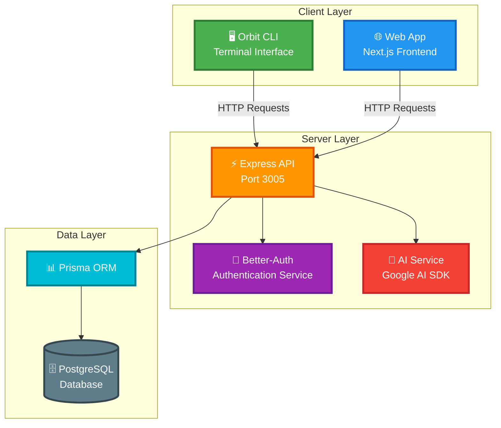
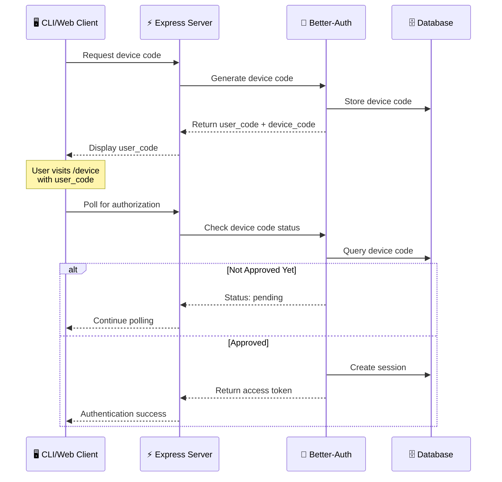
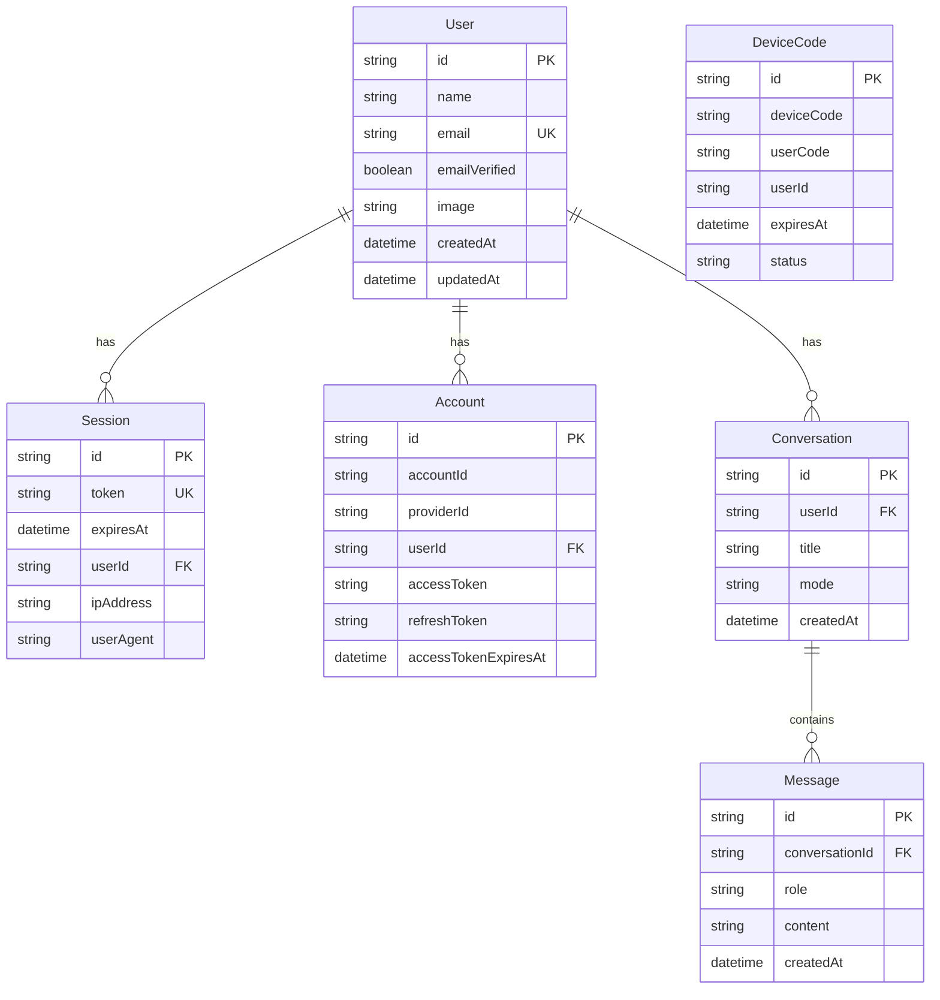

<div align="center">

# 🚀 Neuro-CLI (Orbit)

### AI-Powered Command-Line Interface & Web Platform

[](https://nextjs.org/)
[](https://reactjs.org/)
[](https://expressjs.com/)
[](https://nodejs.org/)
[](https://www.postgresql.org/)
[](https://www.prisma.io/)
[](https://www.typescriptlang.org/)

**A modern full-stack AI platform combining a powerful CLI tool with a beautiful web interface for seamless AI interactions**

[Features](#-features) • [Architecture](#-architecture) • [Quick Start](#-quick-start) • [Documentation](#-documentation) • [CLI Usage](#-orbit-cli-usage)

</div>

---

## 📋 Overview

**Neuro-CLI** is a comprehensive AI-powered platform that provides multiple interfaces for interacting with advanced AI models. The project consists of:

- 🖥️ **Orbit CLI** - A powerful command-line interface for AI interactions directly from your terminal
- 🌐 **Web Application** - A modern Next.js-based web platform with rich UI components
- 🔐 **Authentication System** - Secure device-flow authentication powered by Better-Auth
- 💾 **Database Layer** - PostgreSQL with Prisma ORM for robust data persistence
- 🤖 **AI Integration** - Google AI SDK for advanced conversational capabilities

## ✨ Features

### 🎯 Core Capabilities

| Feature                     | Description                                         |
| --------------------------- | --------------------------------------------------- |
| **Multi-Modal AI Chat**     | Engage with AI through chat, tool, and agent modes  |
| **Device Flow Auth**        | Secure authentication across CLI and web platforms  |
| **Conversation Management** | Persistent conversation history and context         |
| **CLI & Web Sync**          | Seamless experience across command-line and browser |
| **Rich UI Components**      | 50+ Radix UI components with TailwindCSS styling    |
| **Real-time Updates**       | Live session management and token validation        |

### 🛠️ Technology Stack

#### Client (Web Application)

- **Framework:** Next.js 16 with React 19
- **Styling:** TailwindCSS 4 with custom design system
- **UI Components:** Radix UI primitives (Accordion, Dialog, Dropdown, etc.)
- **Form Management:** React Hook Form with Zod validation
- **Authentication:** Better-Auth client integration
- **Charts:** Recharts for data visualization
- **Theming:** Next-themes for dark/light mode

#### Server (API & CLI)

- **Runtime:** Node.js with Express 5.1
- **Database:** PostgreSQL with Prisma ORM
- **Authentication:** Better-Auth with device flow
- **AI:** Google AI SDK (@ai-sdk/google, ai)
- **CLI Framework:** Commander.js with Clack prompts
- **Styling:** Chalk for terminal colors, Figlet for ASCII art
- **Utilities:** Boxen, Ora spinners, Inquirer for interactive prompts

## 🏗️ Architecture

### System Overview



### Authentication Flow



### Database Schema



## 📁 Project Structure

```
Neuro-CLI/
├── 📂 client/                    # Next.js Web Application
│   ├── app/                      # Next.js App Router
│   │   ├── (auth)/              # Authentication routes
│   │   ├── approve/             # Device approval flow
│   │   ├── device/              # Device code entry
│   │   └── page.tsx             # Home page
│   ├── components/              # 50+ UI components
│   │   └── ui/                  # Radix UI primitives
│   ├── hooks/                   # Custom React hooks
│   ├── lib/                     # Utilities and helpers
│   ├── public/                  # Static assets
│   └── package.json             # Client dependencies
│
├── 📂 server/                    # Express.js API Server
│   ├── src/
│   │   ├── cli/                 # Orbit CLI implementation
│   │   │   ├── main.js          # CLI entry point
│   │   │   ├── commands/        # CLI commands
│   │   │   │   ├── auth/        # Auth commands (login, logout, whoami)
│   │   │   │   └── ai/          # AI commands (wakeUp)
│   │   │   ├── chat/            # Chat implementations
│   │   │   └── ai/              # AI service integrations
│   │   ├── config/              # Server configuration
│   │   ├── lib/                 # Shared libraries
│   │   ├── services/            # Business logic
│   │   └── index.js             # Express server entry
│   ├── prisma/
│   │   └── schema.prisma        # Database schema
│   └── package.json             # Server dependencies
│
└── README.md                     # This file
```

## 🚀 Quick Start

### Prerequisites

Ensure you have the following installed:

| Tool       | Version        | Download                                      |
| ---------- | -------------- | --------------------------------------------- |
| Node.js    | 18.x or higher | [nodejs.org](https://nodejs.org/)             |
| npm        | 9.x or higher  | Included with Node.js                         |
| PostgreSQL | 14.x or higher | [postgresql.org](https://www.postgresql.org/) |
| Git        | Latest         | [git-scm.com](https://git-scm.com/)           |

### Installation

1. **Clone the Repository**

   ```bash
   git clone <repository-url>
   cd Neuro-CLI
   ```

2. **Install Server Dependencies**

   ```bash
   cd server
   npm install
   ```

3. **Install Client Dependencies**
   ```bash
   cd ../client
   npm install
   ```

### Configuration

4. **Setup Environment Variables**

   Create `.env` files based on the example templates:

   **Server** (`server/.env`):

   ```bash
   cd ../server
   cp .env.example .env
   # Edit .env with your configuration
   ```

   **Client** (`client/.env`):

   ```bash
   cd ../client
   cp .env.example .env
   # Edit .env with your configuration
   ```

   See [Server Documentation](./server/README.md#environment-variables) and [Client Documentation](./client/README.md#environment-variables) for detailed variable descriptions.

5. **Setup Database**
   ```bash
   cd ../server
   npx prisma generate
   npx prisma db push
   ```

### Running the Application

6. **Start the Server** (Terminal 1)

   ```bash
   cd server
   npm run dev
   ```

   Server will run on `http://localhost:3005`

7. **Start the Client** (Terminal 2)

   ```bash
   cd client
   npm run dev
   ```

   Web app will run on `http://localhost:3000`

8. **Use the CLI** (Terminal 3)
   ```bash
   cd server
   npm run cli -- --help
   ```

## 🖥️ Orbit CLI Usage

### Available Commands

| Command  | Description                  | Usage                   |
| -------- | ---------------------------- | ----------------------- |
| `login`  | Authenticate via device flow | `npm run cli -- login`  |
| `logout` | End current session          | `npm run cli -- logout` |
| `whoami` | Display current user info    | `npm run cli -- whoami` |
| `wakeUp` | Start AI chat session        | `npm run cli -- wakeUp` |

### Example Workflow

```bash
# 1. Authenticate
npm run cli -- login
# Follow the prompts to complete device authentication

# 2. Check authentication status
npm run cli -- whoami

# 3. Start chatting with AI
npm run cli -- wakeUp
# Choose your mode: chat, tool, or agent

# 4. Logout when done
npm run cli -- logout
```

### CLI Features

- 🎨 **Beautiful Terminal UI** - Styled with Chalk and ASCII art
- ⚡ **Interactive Prompts** - Powered by Clack and Inquirer
- 🔄 **Real-time Feedback** - Animated spinners and progress indicators
- 📝 **Markdown Rendering** - Terminal-formatted AI responses
- 💾 **Persistent Sessions** - Token-based authentication

## 📚 Documentation

For detailed documentation, please refer to:

- **[Client Documentation](./client/README.md)** - Next.js web application setup and development
- **[Server Documentation](./server/README.md)** - Express API, CLI, and database documentation

### API Endpoints

| Endpoint                | Method | Description                          |
| ----------------------- | ------ | ------------------------------------ |
| `/api/auth/*`           | ALL    | Better-Auth authentication endpoints |
| `/api/me`               | GET    | Get current session (Bearer token)   |
| `/api/me/:access_token` | GET    | Get session by token (deprecated)    |
| `/device`               | GET    | Redirect to device code entry page   |

## 🔧 Development

### Build Commands

| Command         | Description                           |
| --------------- | ------------------------------------- |
| `npm run dev`   | Start development server (hot reload) |
| `npm run build` | Build for production                  |
| `npm start`     | Start production server               |
| `npm run lint`  | Run ESLint                            |

### Database Management

```bash
# Generate Prisma Client
npx prisma generate

# Push schema changes to database
npx prisma db push

# Open Prisma Studio
npx prisma studio

# Create migration
npx prisma migrate dev --name migration_name
```

## 🤝 Contributing

Contributions are welcome! Please feel free to submit a Pull Request.

1. Fork the project
2. Create your feature branch (`git checkout -b feature/AmazingFeature`)
3. Commit your changes (`git commit -m 'Add some AmazingFeature'`)
4. Push to the branch (`git push origin feature/AmazingFeature`)
5. Open a Pull Request

## 📄 License

This project is licensed under the ISC License.

## 👨‍💻 Author

Built with ❤️ by the Neuro-CLI team

---

<div align="center">

**[⬆ Back to Top](#-neuro-cli-orbit)**

Made with Next.js, Express, and Google AI SDK

</div>
