<div align="center">

# 🌐 Neuro-CLI - Web Client

### Modern Next.js Frontend with AI Chat Interface

[](https://nextjs.org/)
[](https://reactjs.org/)
[](https://www.typescriptlang.org/)
[](https://tailwindcss.com/)

[Overview](#-overview) • [Installation](#-installation) • [Configuration](#-configuration) • [Development](#-development)

</div>

---

## 📋 Overview

The **Neuro-CLI Web Client** is a modern, responsive web application built with Next.js 16 and React 19. It provides a beautiful user interface for AI interactions, device-flow authentication, and conversation management.

### Key Features

✨ **Modern UI/UX**

- 50+ pre-built Radix UI components
- Dark/Light theme support with next-themes
- Responsive design for all screen sizes
- Smooth animations and transitions

🔐 **Authentication**

- Device-flow authentication integration
- Better-Auth client library
- Secure session management
- OAuth provider support

🤖 **AI Capabilities**

- Multiple conversation modes (chat, tool, agent)
- Real-time AI responses
- Conversation history
- Rich message formatting

📊 **Data Visualization**

- Recharts for analytics
- Interactive charts and graphs
- Data-driven insights

## 🏗️ Application Architecture

```mermaid
graph TD
    subgraph "App Router Structure"
        ROOT[🏠 / - Landing Page]
        AUTH[🔐 /auth - Authentication]
        DEVICE[📱 /device - Device Code Entry]
        APPROVE[✅ /approve - Code Approval]
    end

    subgraph "Component Layer"
        UI[🎨 UI Components<br/>Radix Primitives]
        CUSTOM[🔧 Custom Components<br/>Business Logic]
    end

    subgraph "Utilities"
        HOOKS[⚡ React Hooks]
        LIB[📚 Helpers & Utils]
    end

    subgraph "External Services"
        API[🔌 Backend API<br/>localhost:3005]
        AUTH_SERVICE[🔐 Better-Auth]
    end

    ROOT --> CUSTOM
    AUTH --> CUSTOM
    DEVICE --> CUSTOM
    APPROVE --> CUSTOM

    CUSTOM --> UI
    CUSTOM --> HOOKS
    CUSTOM --> LIB

    ROOT --> API
    AUTH --> AUTH_SERVICE
    API --> AUTH_SERVICE

    style ROOT fill:#2196F3,stroke:#1565C0,stroke-width:2px,color:#fff
    style AUTH fill:#9C27B0,stroke:#6A1B9A,stroke-width:2px,color:#fff
    style DEVICE fill:#FF9800,stroke:#E65100,stroke-width:2px,color:#fff
    style APPROVE fill:#4CAF50,stroke:#2E7D32,stroke-width:2px,color:#fff
    style UI fill:#F44336,stroke:#C62828,stroke-width:2px,color:#fff
```



## 🛠️ Technology Stack

### Core Framework

| Technology      | Version | Purpose                         |
| --------------- | ------- | ------------------------------- |
| **Next.js**     | 16.0.1  | React framework with App Router |
| **React**       | 19.2.0  | UI library                      |
| **TypeScript**  | 5.x     | Type-safe JavaScript            |
| **TailwindCSS** | 4.x     | Utility-first CSS framework     |

### UI Components

The application uses **Radix UI** primitives for accessible, unstyled components:

| Component Library      | Components                                                                                                                                                                                                           |
| ---------------------- | -------------------------------------------------------------------------------------------------------------------------------------------------------------------------------------------------------------------- |
| **@radix-ui/react-\*** | Accordion, Alert Dialog, Avatar, Checkbox, Dialog, Dropdown Menu, Hover Card, Label, Menubar, Navigation Menu, Popover, Progress, Radio Group, Scroll Area, Select, Separator, Slider, Switch, Tabs, Toggle, Tooltip |
| **lucide-react**       | Icon library with 1000+ icons                                                                                                                                                                                        |
| **cmdk**               | Command palette component                                                                                                                                                                                            |
| **vaul**               | Drawer component                                                                                                                                                                                                     |
| **sonner**             | Toast notifications                                                                                                                                                                                                  |

### Form Management

| Library                 | Purpose               |
| ----------------------- | --------------------- |
| **react-hook-form**     | Form state management |
| **@hookform/resolvers** | Validation resolver   |
| **zod**                 | Schema validation     |
| **input-otp**           | OTP input component   |

### Data & Visualization

| Library              | Purpose            |
| -------------------- | ------------------ |
| **recharts**         | Chart components   |
| **date-fns**         | Date manipulation  |
| **react-day-picker** | Calendar component |

### Utilities

| Library                      | Purpose                       |
| ---------------------------- | ----------------------------- |
| **clsx**                     | Conditional className utility |
| **tailwind-merge**           | Merge Tailwind classes        |
| **class-variance-authority** | Component variants            |
| **next-themes**              | Theme management              |
| **embla-carousel-react**     | Carousel component            |
| **react-resizable-panels**   | Resizable layouts             |

### Authentication

| Library         | Purpose               |
| --------------- | --------------------- |
| **better-auth** | Authentication client |

## 📁 Project Structure

```
client/
├── app/                          # Next.js App Router
│   ├── (auth)/                  # Auth route group
│   │   ├── login/               # Login page
│   │   └── register/            # Registration page
│   ├── approve/                 # Device code approval
│   │   └── page.tsx
│   ├── device/                  # Device code entry
│   │   └── page.tsx
│   ├── layout.tsx               # Root layout
│   ├── page.tsx                 # Home page
│   ├── globals.css              # Global styles
│   └── favicon.ico              # App icon
│
├── components/                   # React components
│   └── ui/                      # Radix UI primitives (50+ components)
│       ├── accordion.tsx
│       ├── alert-dialog.tsx
│       ├── avatar.tsx
│       ├── button.tsx
│       ├── card.tsx
│       ├── dialog.tsx
│       ├── dropdown-menu.tsx
│       ├── input.tsx
│       ├── select.tsx
│       ├── toast.tsx
│       └── ... (45+ more)
│
├── hooks/                        # Custom React hooks
│   └── use-mobile.tsx           # Mobile detection hook
│
├── lib/                          # Utilities and helpers
│   └── utils.ts                 # Common utility functions
│
├── public/                       # Static assets
│   ├── images/                  # Images
│   └── fonts/                   # Custom fonts
│
├── .env                          # Environment variables (create from .env.example)
├── .env.example                 # Environment template
├── components.json              # Shadcn UI config
├── next.config.ts               # Next.js configuration
├── tailwind.config.ts           # Tailwind configuration
├── tsconfig.json                # TypeScript configuration
├── postcss.config.mjs           # PostCSS configuration
├── eslint.config.mjs            # ESLint configuration
└── package.json                 # Dependencies
```

## 🚀 Installation

### Prerequisites

- Node.js 18.x or higher
- npm 9.x or higher
- Backend server running (see [Server README](../server/README.md))

### Setup Steps

1. **Navigate to Client Directory**

   ```bash
   cd client
   ```

2. **Install Dependencies**

   ```bash
   npm install
   ```

3. **Configure Environment Variables**

   ```bash
   cp .env.example .env
   ```

   Edit `.env` with your configuration (see [Environment Variables](#-environment-variables))

4. **Run Development Server**

   ```bash
   npm run dev
   ```

   Open [http://localhost:3000](http://localhost:3000) in your browser

## ⚙️ Configuration

### Environment Variables

Create a `.env` file in the client directory with the following variables:

| Variable               | Description                | Example                          | Required |
| ---------------------- | -------------------------- | -------------------------------- | -------- |
| `NEXT_PUBLIC_API_URL`  | Backend API base URL       | `http://localhost:3005`          | ✅ Yes   |
| `NEXT_PUBLIC_AUTH_URL` | Authentication service URL | `http://localhost:3005/api/auth` | ✅ Yes   |
| `NEXT_PUBLIC_APP_URL`  | Frontend application URL   | `http://localhost:3000`          | ✅ Yes   |

**Example `.env` file:**

```env
# API Configuration
NEXT_PUBLIC_API_URL=http://localhost:3005
NEXT_PUBLIC_AUTH_URL=http://localhost:3005/api/auth
NEXT_PUBLIC_APP_URL=http://localhost:3000
```

> [!IMPORTANT]
> All client-side environment variables must be prefixed with `NEXT_PUBLIC_` to be accessible in the browser.

## 💻 Development

### Available Scripts

| Command         | Description                                   |
| --------------- | --------------------------------------------- |
| `npm run dev`   | Start development server (hot reload enabled) |
| `npm run build` | Build production bundle                       |
| `npm start`     | Start production server                       |
| `npm run lint`  | Run ESLint for code quality                   |

### Development Workflow

1. **Start the Development Server**

   ```bash
   npm run dev
   ```

   - Hot Module Replacement (HMR) enabled
   - Runs on `http://localhost:3000`
   - Auto-restarts on file changes

2. **Code Quality**

   ```bash
   npm run lint
   ```

   - ESLint checks for code quality
   - Next.js specific configurations
   - TypeScript type checking

3. **Build for Production**
   ```bash
   npm run build
   npm start
   ```

   - Optimized production bundle
   - Static optimization where possible
   - Image optimization

### Adding New Components

This project uses **Radix UI** primitives. To add new UI components:

```bash
# Components are already installed
# Import and use from ./components/ui/
```

Example usage:

```tsx
import { Button } from "@/components/ui/button";
import { Dialog } from "@/components/ui/dialog";

export default function MyComponent() {
  return (
    <Dialog>
      <Button>Click me</Button>
    </Dialog>
  );
}
```

## 🎨 Theming

### Dark/Light Mode

The application supports theme switching using `next-themes`:

```tsx
import { useTheme } from "next-themes";

function ThemeToggle() {
  const { theme, setTheme } = useTheme();

  return (
    <button onClick={() => setTheme(theme === "dark" ? "light" : "dark")}>
      Toggle Theme
    </button>
  );
}
```

### Customizing Styles

Tailwind configuration in `tailwind.config.ts`:

- Custom color palette
- Design tokens
- Component utilities
- Animation presets

Global styles in `app/globals.css`:

- CSS variables for theming
- Base component styles
- Utility classes

## 🔒 Authentication Flow

```mermaid
sequenceDiagram
    participant User
    participant WebApp as 🌐 Web App
    participant Server as ⚡ Backend
    participant Auth as 🔐 Better-Auth

    User->>WebApp: Visit /device with user_code
    WebApp->>Server: Verify user_code
    Server->>Auth: Check device code
    Auth-->>Server: Code details
    Server-->>WebApp: Code valid

    User->>WebApp: Click "Approve"
    WebApp->>Server: Approve device code
    Server->>Auth: Authorize device
    Auth->>Auth: Create session
    Auth-->>Server: Session created
    Server-->>WebApp: Success
    WebApp->>User: Show success message
```



## 📦 Build & Deployment

### Production Build

```bash
# Create optimized production build
npm run build

# Test production build locally
npm start
```

### Build Output

- `.next/` - Build output directory
- Static pages optimized automatically
- API routes bundled as serverless functions
- Images optimized with Next.js Image Optimization

### Deployment Options

| Platform        | Command                      | Documentation                                                     |
| --------------- | ---------------------------- | ----------------------------------------------------------------- |
| **Vercel**      | `vercel deploy`              | [Vercel Docs](https://vercel.com/docs)                            |
| **Netlify**     | `netlify deploy`             | [Netlify Docs](https://docs.netlify.com)                          |
| **Docker**      | Custom Dockerfile            | [Next.js Docker](https://nextjs.org/docs/deployment#docker-image) |
| **Self-hosted** | `npm run build && npm start` | [Next.js Deployment](https://nextjs.org/docs/deployment)          |

### Environment Variables for Production

Ensure all environment variables are set in your deployment platform:

```env
NEXT_PUBLIC_API_URL=https://your-api-domain.com
NEXT_PUBLIC_AUTH_URL=https://your-api-domain.com/api/auth
NEXT_PUBLIC_APP_URL=https://your-app-domain.com
```

## 🐛 Troubleshooting

### Common Issues

| Issue                                 | Solution                                     |
| ------------------------------------- | -------------------------------------------- |
| **Port 3000 already in use**          | Change port: `PORT=3001 npm run dev`         |
| **Build errors**                      | Clear cache: `rm -rf .next && npm run build` |
| **Environment variables not working** | Ensure variables have `NEXT_PUBLIC_` prefix  |
| **API connection failed**             | Check backend is running on correct port     |
| **Auth not working**                  | Verify `NEXT_PUBLIC_AUTH_URL` matches server |

### Debug Mode

```bash
# Enable verbose logging
NODE_OPTIONS='--inspect' npm run dev
```

## 🔗 Related Documentation

- [Root README](../README.md) - Project overview
- [Server README](../server/README.md) - Backend documentation
- [Next.js Documentation](https://nextjs.org/docs)
- [Radix UI Documentation](https://www.radix-ui.com/)
- [TailwindCSS Documentation](https://tailwindcss.com/docs)

---

<div align="center">

**[⬆ Back to Top](#-neuro-cli---web-client)**

Built with Next.js 16 and React 19

</div>
